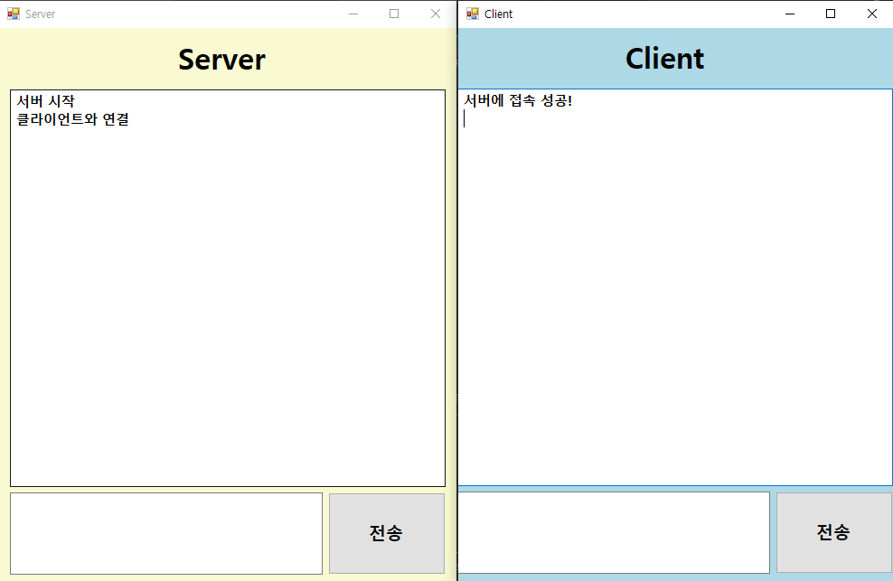

# WinFormTCPChat

C# WinForms 기반의 로컬 채팅 프로그램입니다.

`TcpListener`와 `TcpClient`, 그리고 `NetworkStream`을 활용해 서버-클라이언트 간 **1:1 텍스트 채팅**을 구현했습니다.

> ⚠️ 현재는 동일 네트워크(로컬) 환경에서만 작동하도록 구성되어 있으며, 원격 접속이 필요할 경우 **IP 주소를 실제 서버의 IP로 변경**해 주세요.
> 

---

## 🧭 프로젝트 소개

- **C# Windows Forms**로 제작된 간단한 데스크탑 채팅 애플리케이션입니다.
- UI는 Visual Studio의 디자이너 도구(컴포넌트 배치)를 사용하여 직관적으로 구성했습니다.
- 네트워크 통신은 TCP 프로토콜 기반이며, 각 프로젝트(Server/Client)는 독립 실행이 가능합니다.

---

## 💡 제작 동기

- TCP 소켓 통신 개념을 실습을 통해 확실히 이해하고자 했습니다.
- 네트워크 기초 학습에 가장 적합한 예제 중 하나인 ‘채팅 프로그램’을 직접 만들어 보며,
    
    실제 **데이터 송수신 흐름**, **멀티스레딩**, **버퍼 처리** 등을 경험하고자 기획했습니다.
    

---

## 📦 프로젝트 구조

```
WinFormTCPChat/
│
├── TCPServer/                        // WinForm Server 폴더
│   ├── Form1.cs/                     // Server 로직
│   │   ├── Form1.Designer.cs         // UI 디자이너 코드 (실제로는 컴포넌트로 직접 배치)
│   │   └── Form1.resx                // 리소스 파일
│   └── Program.cs                    // 진입점
│
├── TCPClient/                        // WinForm Client 폴더
│   ├── Form1.cs/                     // Client 로직
│   │   ├── Form1.Designer.cs         // UI 디자이너 코드
│   │   └── Form1.resx                // 리소스 파일
│   └── Program.cs                    // 진입점
```

---

## 🗓️ 제작 기간

- **2025.06.02 ~ 2025.06.08 (7일)**

---

## 🧑 제작 인원

- 개인 프로젝트 (1인 개발)

---

## 🛠️ 사용 기술

- **Language**: `C#`
- **Framework**: `.NET 8.0 WinForms`
- **Networking**: `System.Net.Sockets`
- **Threading**: `System.Threading`
- **IDE**: `Visual Studio 2022 Community`

---

## 🧑‍💻 개발 중 겪은 문제 및 해결 방식

### 메시지 전송 지연

- **문제**: 클라이언트가 메시지를 전송해도 즉시 화면에 반영되지 않음
- **원인**: `StreamWriter`의 내부 버퍼에 데이터가 남아 있음
- **해결**: `Writer.Flush()` 호출로 버퍼 강제 비우기 → 메시지가 바로 전송됨

### UI 스레드 충돌

- **문제**: 채팅 메시지 수신 후 `TextBox`에 바로 출력하려 하자 `InvalidOperationException` 예외 발생
- **원인**: Windows Forms에서는 UI 요소(`TextBox`, `Label` 등)는 **UI 스레드에서만 접근 가능**
    
    그런데 메시지를 수신하는 쓰레드는 별도의 **백그라운드 스레드**에서 동작하기 때문에 예외 발생
    
- **해결**:
    1. 델리게이트(`AddTextDelegate`) 정의
    2. `this.Invoke(delegate, text)` 를 사용해 UI 스레드로 안전하게 작업 위임
        
        → WinForms에서 자주 사용되는 **스레드 간 안전한 통신 패턴**
        

---

## ✨ 배운 점

- `TcpClient` / `TcpListener` 구조 및 통신 방식
- WinForms에서 **멀티스레딩 환경에서 UI 접근 시 주의점**
- 버퍼와 플러시(Flush)의 중요성
- 네트워크 기반 애플리케이션의 기초 구조 설계법

---

## ▶️ 실행 방법

1. `TCPServer` 프로젝트를 먼저 빌드 및 실행합니다.
2. `TCPClient` 프로젝트를 빌드 및 실행합니다.
3. 두 앱 모두 `텍스트 입력 후 전송` 버튼을 클릭하면 채팅 메시지를 주고받을 수 있습니다.
4. `TCPClient.cs` 내 IP 주소는 현재 개발 PC의 실제 IP로 수정하세요.

> 💡 방화벽이 네트워크 포트를 차단할 경우, 예외를 수동으로 허용해 주세요.
> 

---

## 📷 실행 화면


